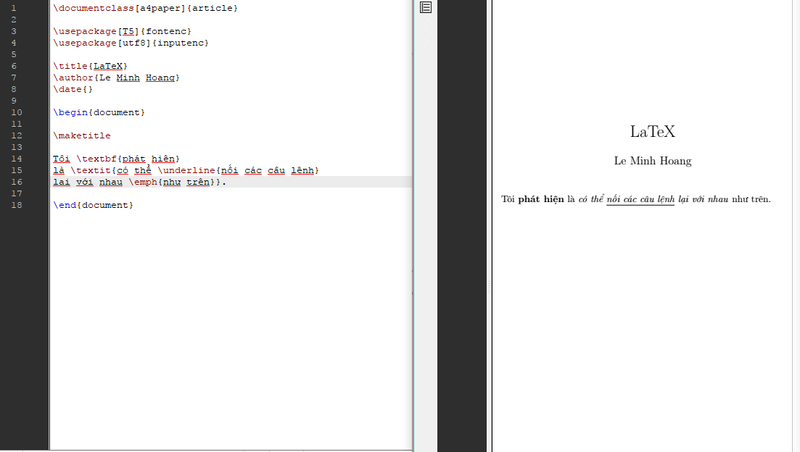

# LaTeX tutorial - Hướng dẫn LaTeX


### Mục lục
* [1. LaTeX là gì?](#latex-là-gì)
* [2. Tại sao dùng Latex?](#tại-sao-dùng-latex)
* [3. Cài đặt LaTeX](#cài-đặt-latex)
* [4. Viết file LaTeX đầu tiên](#viết-file-latex-đầu-tiên)
* [5. Sâu hơn](#sau-hon)
* [6. Gõ Tiếng Việt](#go-tieng-viet)
* [7. Lists](#lists)
* [8. Section](#section)
* [9. Package](#package)
* [10. Chèn ảnh](#chèn-ảnh)
* [11. Chèn code](#chèn-code)

## LaTeX là gì?

LaTeX là một gói các tập lệnh cho phép tác giả có thể soạn thảo và in ấn tài liệu của mình với chất lượng bản in cao nhờ việc thống nhất cách trình bày từ trước. LaTeX thường được sử dụng trong các tài liệu kĩ thuật lớn hoặc văn bản khoa học, nhưng cũng có thể dùng cho bất kì loại bài viết nào.

## Tại sao dùng LaTeX?

* LaTeX chỉ là file văn bản (mở bằng bất kì editor nào cũng được), dễ chuyển thành PDF.
* LaTeX thuận lợi cho thiết kế văn bản. Chỉ cần thiết kế một lần rồi tập trung vào nội dung.
* Năng suất cao hơn hẳn Word.
* LaTeX được dùng rất nhiều trong các chủ đề về khoa học.
* LaTeX là cách tốt nhất để viết các kí tự toán học.

## Cài đặt Latex

Bạn sẽ cần những thứ sau.

1. *Một phiên bản LaTeX.*
Tôi sử dụng [MiKTeX](https://miktex.org/about) cho Windows.
2. *LaTeX Editor.*
Tôi sử dụng [TeXMaker](http://www.xm1math.net/texmaker/) để dễ chỉnh sửa, dù vây bất kì editor nào cũng viết LaTeX file được.

Thêm vào đó, bạn cần chọn một [compiler](#additional-tools). Đa số măc định là pdfLaTeX, nhưng nếu cần viết Unicode hay TTF/OTF fonts thì có thể dùng LuaLaTeX.

## Viết file LaTeX đầu tiên

Hãy viết dòng đầu tiên trong **LaTeX** nào!

Nếu bạn dùng **TexMaker**, đầu tiên ấn `Ctrl + N` để mở file mới. Sau đó gõ những dòng sau để xuất ra "Hello!", ấn `Ctrl +S` để lưu lại. Sau đó ấn mũi tên bên trái "quick build" hoặc đơn giản là ấn `F1`.

Tất nhiên bạn cũng có thể dùng các biểu tượng trên thanh công cụ thay ấn phím tắt. 

```tex
\documentclass[a4paper]{article}

\begin{document}

Hello LaTeX!	% Nội dung bài viết ở đây

\end{document}
```

Kết quả sẽ trông như thế này (hình của tôi được phóng to cho dễ thấy)


## Sâu hơn

Nếu bạn nhìn kĩ thì file LaTeX có các phần sau :

* Dòng đầu tiên báo rằng bạn đang làm việc với loại văn bản **article** cỡ giấy a4. Bạn có thể sẽ muốn những loại khác như **report**, **book**... 
* Văn bản nằm giữa **\begin{document}** và **\end{document}** . Không có begin và end thì không thể xuất ra văn bản được. 
* Phần nằm giữa begin and end sẽ là nội dung bạn muốn trình bày.
* Dấu phần trăm (%) dùng để bắt đầu comment, LaTeX sẽ bỏ qua.

#### Chú ý

* Hãy chú ý đến **\begin{document}** , **\end{document}** , **\documentclass[a4paper]{article}** .Bạn có thể nhận ra chúng đều có chung một kiểu viết. Nững cái này được gọi **Typesetting Commands** - câu lệnh định dạng văn bản (không biết nói sao cho hợp), bắt đầu với `\` và **một biến gì đó** ( đặt trong `{}` ).
* Google thường luôn có đủ câu trả lời nếu bạn gặp rắc rối.  
* TeXMaker sẽ giúp bạn tự hoàn thành các câu lệnh bằng cách hiện ra gợi ý. Bạn có thể chọn bằng cách ấn `Enter` .
* Chương trình sẽ tạo một file pdf với tên giống file tex bạn tạo ra trong cùng một folder.
* Một số kí tự, cụm kí tự được xem là **đặc biệt** trong LaTeX.Bạn sẽ muốn gõ (\\) trước các kí tự này. Ví dụ như $ và %.

   

## Gõ tiếng việt

Ở đây mình sẽ nêu cách giải quyết cho complier mặc định pdfLaTeX. 

Bằng cách gắn thêm `packages` (sẽ tìm hiểu sau) để thoát khỏi giới hạn pdfLaTeX là 256 kí tự kèm nhiều vấn đề khi encoding. Ví dụ:  

```tex
\documentclass[a4paper]{article}

\usepackage[T5]{fontenc}
\usepackage[utf8]{inputenc}

\begin{document}

Xin chào!

\end{document}
```

Nếu package manager có hỏi thì ấn Install rồi Yes để chấp nhận cài đặt.
Ở đây ta dùng `usepackage[T5]{fontenc}` và `usepackage[utf8]{inputenc}` . Đơn giản là chúng sẽ tải thêm font để in ra cho thích hợp. Bạn sẽ thấy nó trông như thế này khi chưa có package:


với sau khi đã có thêm package:  

  

## Tiêu đề, tác giả và ngày tháng

Để thêm tiêu đề, tác giả và ngày tháng, bạn cần thêm vào trước của phần chính (phần giữa begin và end). Những dòng đó là

`\title{Document}`
Đây là tiêu đề

`\author{Le Minh Hoang}`
Đây là tác giả

`\date{September 2017}`
Hiển thị ngày. Nếu bạn không ghi thì mặc định là ngày bạn soạn file hay là `\today` . Còn nếu không muốn hiển thị thì dùng `\date{}`

Bạn có thể hiểu cả ba như thể là biến trong lập trình để sau đó cho vào vào bản.

 

# Bold, italics, underline

Bold là chữ đậm, italics là nghiêng, underline là gạch dưới. Nhưng tôi để nguyên để bạn có thể dễ nhớ command hơn. Command của chúng lần lượt là: `\textbf{...}` , `\textit{...}` , `\underline{...}` .

Một command đặc biệt khác là `\emph{...}`, nếu đoạn kí tự trước nó thẳng thì nó sẽ nghiêng, còn nếu các kí tự phía trước nghiên thì sẽ thành viết thẳng. Đơn giản là đảo ngược tùy theo đoạn văn bản.

```tex
\documentclass[a4paper]{article}

\usepackage[T5]{fontenc}
\usepackage[utf8]{inputenc}

\title{LaTeX}
\author{Le Minh Hoang}
\date{}

\begin{document}

\maketitle

Tôi \textbf{phát hiện} 
là \textit{có thể \underline{nối các câu lệnh}
lại với nhau \emph{như trên}}.

\end{document}
```

Hiển thị:

 

## Lists

Bạn sẽ luôn cần lists - danh sách để cho văn bản có cấu trúc dễ hiểu. Có 2 loại danh sách là **theo thứ tự** and **không theo thứ tự**. Each of them can be handled with ease in LaTeX document :  
* Không theo thứ tự: `itemize`

```tex
\begin{itemize}
    \item Item.
    \item Another Item.
\end{itemize}
```  

* Theo thứ tự: `enumerate`  

```tex
\begin{enumerate}
    \item First Item.
    \item Second Item.
\end{enumerate}
```

Toàn bộ file tex:

```tex
\documentclass[a4paper]{article}

\usepackage[T5]{fontenc}
\usepackage[utf8]{inputenc}

\title{LaTeX}
\author{Le Minh Hoang}
\date{}

\begin{document}

\maketitle

\begin{itemize}
  \item Tao không phải hàng hóa mà đánh số nhé.
  \item Thế dấu chấm đen ở đầu thì hay nhỉ?
  \item Item trong danh sách dài bao nhiêu cũng được.
\end{itemize}

\begin{enumerate}
  \item Xếp hàng. Nhanh chân đứng số 1.
  \item Đậu xanh không chen được rồi. 1 tăng thêm 1 là 2.
  \item Xếp sau tiếp là 2 thêm 1 và là 3.
\end{enumerate}

\end{document}
```

Kết quả:


## Section

Chúng ta bắt đầu một mục với `\section{...}`.

Lưu ý: Nếu ở giữa `{}` không có gì thì văn bản chỉ có số chứ không có tên mục.


## Package

LaTeX có sẵn rất nhiều function, nhưng đôi lúc dùng package làm một việc gì đó sẽ tiện tay hơn. Để dùng package, bạn chi cần thêm `\usepackage`. Giống hệt như lúc đầu bạn thêm vào để gõ Tiếng Việt

Đây là ví dụ của dùng package để căn giữa và thêm dấu chấm sau section:


Bạn nên google tìm các package cần thiết tùy theo nhu cầu. Mình chỉ ví dụ thôi.

## Chèn ảnh

Để chèn ảnh, bạn cần graphicx package. Sử dụng `\usepackage{graphicx}` và

```tex
\begin{figure}
  \includegraphics[width=\linewidth]{filename.jpg}
  \caption{Nội dung bức ảnh}
  \label{Nhãn bức ảnh}
\end{figure}
```

Lưu ý là bạn phải đưa đường dẫn tới bức ảnh chính xác. Nếu cùng folder thì chỉ cần ghi tên file là được. 

```tex
\begin{figure}
  \includegraphics[width=\textwidth]{img.jpg}
  \caption{Ảnh}
  \label{Ảnh 1}
  \centering
\end{figure}
```

**Tips**: [width=\linewidth] chỉnh độ dài bức ảnh so với văn bản. `\centering` căn giữa giữa bức ảnh. 

Còn đây là kết quả


## Chèn code

#### Cách 1

Một trong những vấn đề quen thuộc của programmer là chèn code vào văn bản.

Với LaTeX, mọi việc rất đơn giản. Bạn chỉ cần cho code vào giữa khung ở dưới là xong. Ví dụ:

```tex
\documentclass[a4paper]{article}

\usepackage[T5]{fontenc}
\usepackage[utf8]{inputenc}

\begin{document}

\begin{verbatim}

int commonCharacterCount(char * s1, char * s2) {
    int common = 0;
    for(int i=0; i<strlen(s1);i++){
        for(int j=0; j<strlen(s2);j++){
            if (s1[i] == s2[j]){
                common++;
                s2[j] = ' ';
                break;
            }
        }
    }
    return common;
}

\end{verbatim}

\end{document}
```

Code nhìn cũng khá chuyên nghiệp đấy chứ. 


#### Cách 2

Cách này cho bạn nhiều lựa chọn hơn như làm màu cùng code, chọn ngôn ngữ cho code hay nhập code từ file khác cùng thư mục. Bạn sẽ không dùng **{verbatim}** mà dùng package **listings**.

Ví dụ:

```tex
\documentclass[a4paper]{article}

\usepackage[T5]{fontenc}
\usepackage[utf8]{inputenc}
\usepackage{listings}
\usepackage{color}

\lstdefinestyle{mystyle}{
keywordstyle=\color{blue},
commentstyle=\color{green},
numbers = left,
stringstyle=\color{codepurple},
basicstyle=\footnotesize
}

\lstset{style=mystyle}

\begin{document}


\begin{lstlisting}[language=Python]
def firstDuplicate(a):
    for i in a:
        a[abs(i)-1] *= -1
        if a[abs(i)-1] > 0:
            return abs(i)
    return -1
\end{lstlisting}

\end{document}
```

Bạn có thể nhận ra rằng

1. Để chèn code , bắt đầu với `\begin{lstlisting}` và kết thúc với `\end{lstlisting}`
2. Để chỉ rõ ngôn ngữ của code dùng `[language=Python]`
3. Để chỉnh sửa cách hiển thị, sử dụng `\usepackage{color}` và tự viết style cho code với `\lstdefinestyle{...}` và dùng với '\lstset{style=....} nhưng cần phải tìm hiểu kĩ thêm về các giấ trị để viết.

Kết quả:


## Yeahoo!!!
Hướng dẫn tuy ngắn nhưng cũng đã bao gồm phần lớn cơ bản về LaTeX.

Cảm ơn bạn đã hoàn thành hướng dẫn. 

Nếu muốn chỉnh sửa hay đóng góp thêm bạn có thể pull requests. 

Mình cũng sẽ rất vui nếu bạn cho star hay fork repository này. 

Thông tin thêm về LaTeX tại [đây](http://www.latex-project.org/help/documentation/) hoặc đơn giản là Google thôi.